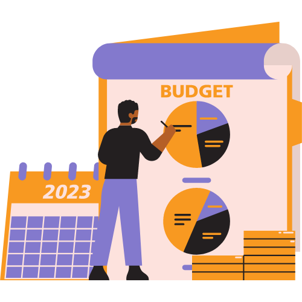
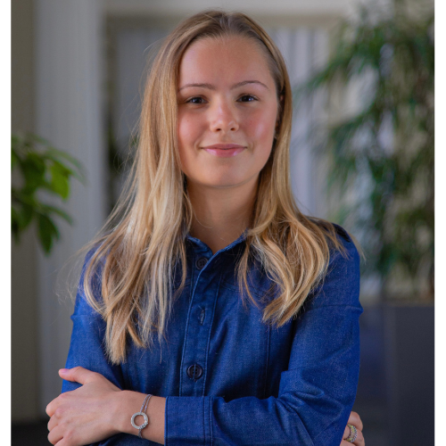
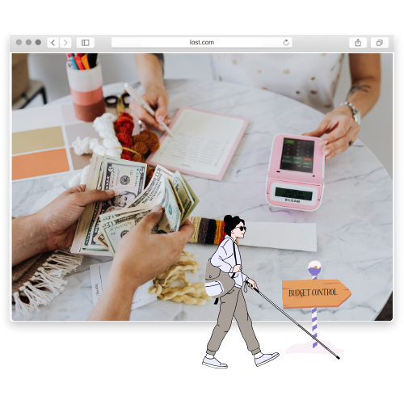
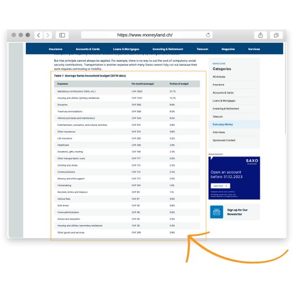
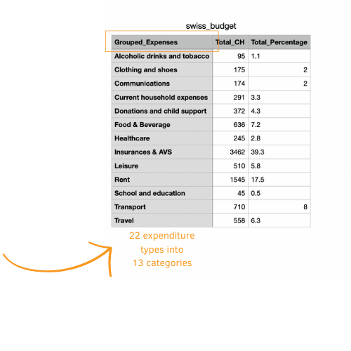
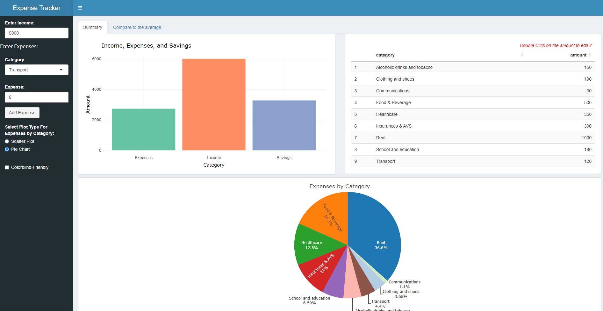
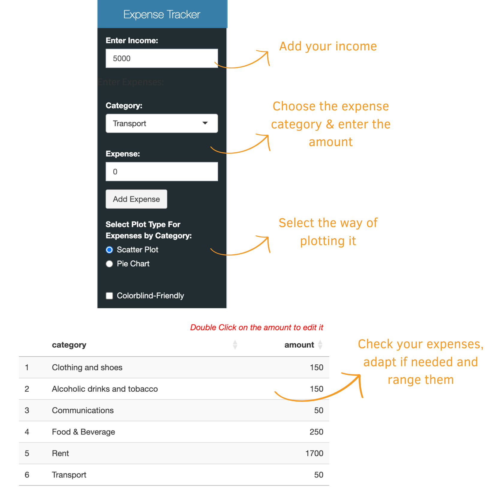
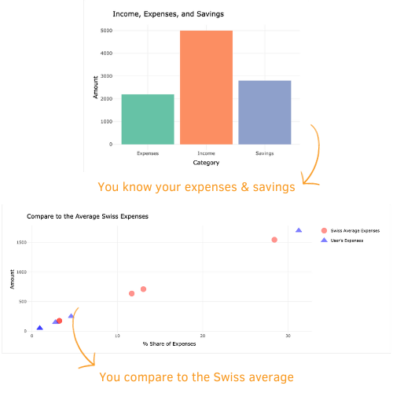
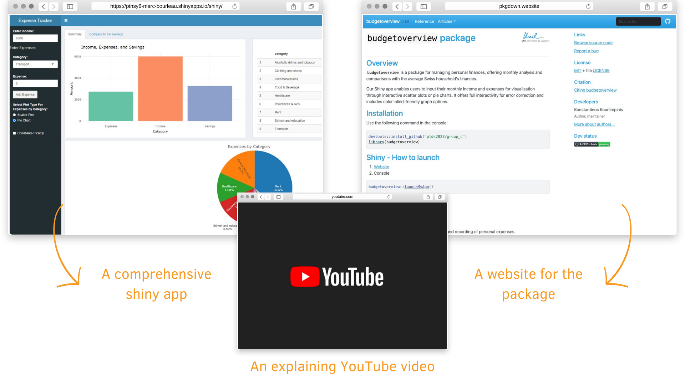

class: left

# Today's Agenda

.pull-left[
#### 1. The Team

#### 2. Background Motivation & Goals

#### 3. Data Collection & Transformation

#### 4. Our Shiny App

#### 5. Optimization & Package Creation

#### 6. The Results

#### 7. Conclusion & Limitations
]

.pull-right[

]
---
class: left, top

# The Team

## The team behind the project
.pull-left[
```{r echo=FALSE, out.width='40%', fig.align='center'}

```
<p style="text-align:center; font-size:70%;">Bourleau Marc<br/>Team Leader</p>
```{r echo=FALSE, out.width='40%', fig.align='center'}

```
<p style="text-align:center; font-size:70%;">Khmilovska Khrystyna<br/>Data Analyst</p>
]

.pull-right[
```{r echo=FALSE, out.width='40%', fig.align='center'}

```
<p style="text-align:center; font-size:70%;">Gillain Eléonore<br/>Marketing Developer</p>
```{r echo=FALSE, out.width='40%', fig.align='center'}

```
<p style="text-align:center; font-size:70%;">Kourlimpinis Konstantinos<br/>Data Analyst</p>
]

---

class: left, middle

# Background Motivation & Goals

## Motivation & Goal

> As independent students, we want to manage our day-to-day expenses better and help Swiss families to do the same [@group]

**This includes:**

- Facilitating savings planning

- Understand spending habits

- Compare with other Swiss families

---
class: left, middle

# Background Motivation & Goals

.pull-left[
## How to achieve this ? 

**Create an interactive R-Shiny app which will:** 

- Provide a clear financial overview

- Visualize spending habits

- Facilitate Budget Planning and Savings
]

.pull-right[

]
---
class: left, middle

# Data Collection & Transformation

.pull-left[

]

.pull-right[

## Data Collection

- Our data comes from “moneyland”<sup>1</sup>
 
- Webscraping authorised

- Average Swiss Household Budget of 2019

- Data collection in dataframe
]

.footnote[
[1] Click [here](https://www.moneyland.ch/fr/argent-depenses-menages-suisses-economiser-conseils#:~:text=En%20moyenne%2C%20les%20d%C3%A9penses%20mensuelles,de%20la%20statistique%20(OFS) to access the website.
]
---
class: left, middle

# Data Collection & Transformation

## Data Transformation

.pull-left[

**Reasons for transformation:**
- Expenditure types too broad
- Not usable by everyone

**Type of transformation:**
- Grouping into comprehensible categories
- Recalculation of amounts and percentages
- Creation of a database for the shiny app
]

.pull-right[

]

---

# Some code examples

```{r tidy=TRUE, eval=FALSE}
# Web scrape the moneyland website
url <- "https://www.moneyland.ch/en/money-budget-household-savings-switzerland"
budget_table <- url %>%
  read_html() %>%
  html_table() %>%
  .[[1]]

.
.

# 2. Convert data
budget_table$per_month_average <- as.numeric(gsub("[^0-9.]", "", budget_table$per_month_average)) 

budget_table$portion_of_budget <- as.numeric(gsub(",", ".", gsub("[^0-9.]", "",budget_table$portion_of_budget)))

.
.

# 4. Aggregate data
swiss_budget <- budget_table %>%
  group_by(grouped_expenses) %>%
  summarise(total_CH = sum(as.numeric(gsub("CH ", "", per_month_average))), #<<
            total_percentage = sum(as.numeric(gsub("%", "", portion_of_budget))))
```

---

background-image: url(pictures/Help.png)
background-position: 50% 50%
class: center, bottom, inverse

# How can we help you ? 

---
class: left, middle

# Our Shiny App
.pull-left[

#### The User's Input:
- Enter your income
- Enter your expenses
  - Select a category & Add the amount
- Choose Visualization
- Colorblind mode

#### The Output:
- Bar Chart for the Savings
- Table of Expenses
- Scatter Plot & Pie Chart


#### Compare with the swiss average
]

.pull-right[

]

---
class: left

# Optimization & Package Creation

## Optimization

.pull-left[
From this...

]

.pull-right[
To this !


]
---
class: left

# Optimization & Package Creation

## Optimization

.pull-left[
And from this...

]

.pull-right[
To this !


]
---

# Our Shiny app & Key features


- User can edit any input
- Error prevention (negative, non-numerical)


---
# Optimization & Package Creation

## Package Creation

Install the **budgetoverview** package from [Github](https://github.com/budgetoverview):

```{r eval=FALSE, tidy=FALSE}
remotes::install_github("budgetoverview")
```

--

You are recommended to use the [RStudio IDE](https://www.rstudio.com/products/rstudio/), but you do not have to.

- Create a new R Markdown document from the menu `File -> New File -> R Markdown -> From Template -> Ninja Presentation`;<sup>1</sup>

--

- Click the `Knit` button to compile it;

--

- or use the [RStudio Addin](https://rstudio.github.io/rstudioaddins/)<sup>2</sup> "Infinite Moon Reader" to live preview the slides (every time you update and save the Rmd document, the slides will be automatically reloaded in RStudio Viewer.

---
# Functions & Testing 

**add_expense**

```{r eval=FALSE, tidy=FALSE}
add_expense <- function(category, amount, expenses_data, selected_categories, session) {
  if (is.na(amount) || amount < 0) { #<<
    showModal(modalDialog(
      title = "Invalid Amount",
      "Amount must be a non-negative number.", #<<
      easyClose = TRUE,
      footer = NULL
    ), session = session)
    return(FALSE)
  }

  if (!(category %in% selected_categories())) {
    new_data <- rbind(expenses_data(), data.frame(category = category, amount = amount))
    expenses_data(new_data)
    selected_categories(c(selected_categories(), category))
    return(TRUE)
  } else {
    return(FALSE)
  }
}
```

---
# Functions & Testing 

**testing**

```{r eval=FALSE, tidy=FALSE}
test_that("add_expense handles invalid amount correctly", { #<<
  expect_error(
    add_expense("Groceries", -10, expenses_data$get, expenses_data$set, selected_categories$get, selected_categories$set)
  )
})
```

**Other tests** 

- Correct class object created
```r
expect_s3_class(plot, "plotly")
```
- Correctly handles empty data
```r
expect_true(is.null(result) || inherits(result, "plotly"))
```
---
class: left, middle

# The Final product



---
class: inverse, left, middle

# Limitations

- Limited time (3 weeks to set up the project)

- Limited number of functionalities due to time constraints (only the essentials)

- Code optimization: some performances may be less efficient.

- Limited data integration: webscraping was used, but larger databases could have been used.

- Interface customization: More/better visualizations

---
background-image: url(pictures/thankyou.png)
background-position: 50% 50%
class: center, bottom, inverse

---
class: inverse, middle, center

THE END


